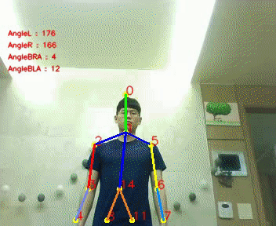
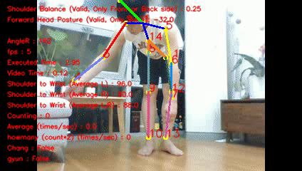
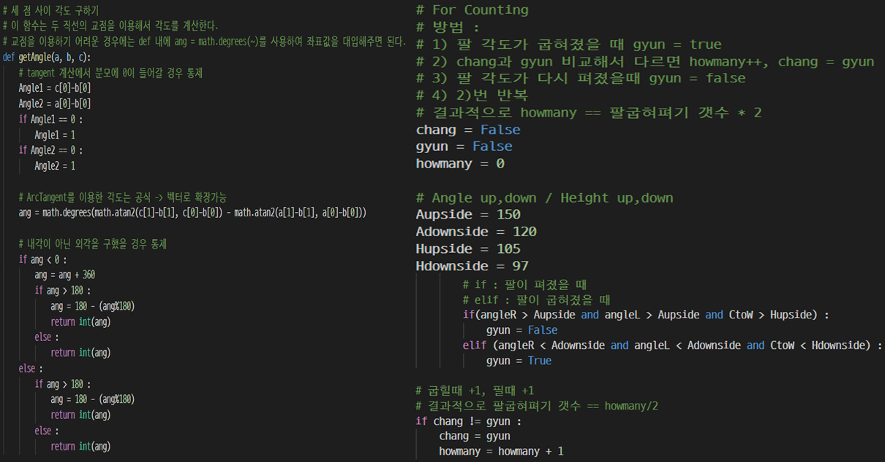
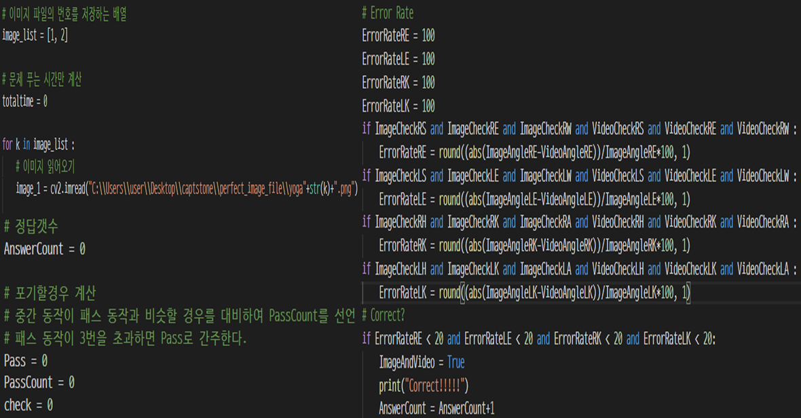
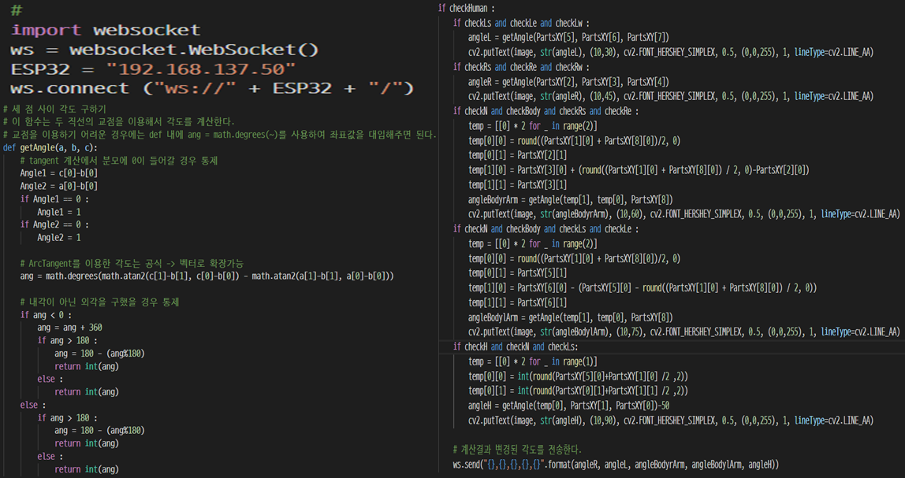
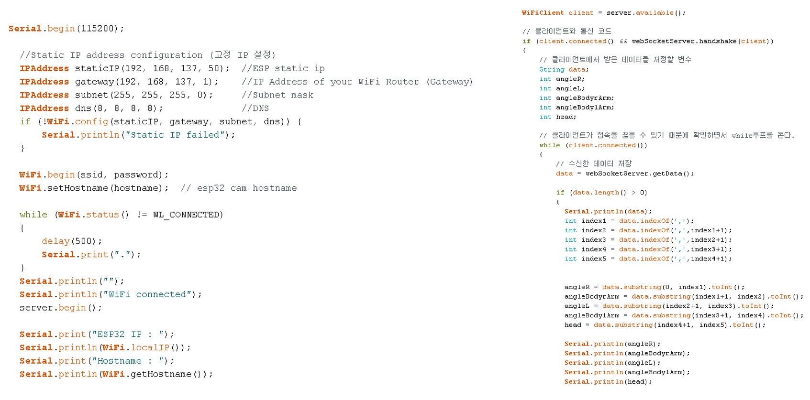

# OpenPose를 이용한 영상처리

-----------------

    
    Authors <a href="https://www.gineshidalgo.com" target="_blank">Gines Hidalgo</a> (left) and <a href="https://jhugestar.github.io" target="_blank">Hanbyul Joo</a> (right) in front of the <a href="http://domedb.perception.cs.cmu.edu" target="_blank">CMU Panoptic Studio</a>
    [**CMU-Perceptual-Computing-Lab**](https://github.com/CMU-Perceptual-Computing-Lab/openpose)
    
    

-----------------

## Contents
1. [Intro](#intro)
2. [Main Function](#main-function)
3. [Using](#using)
4. [Presentation and Testing Video](#presentation-and-testing-video)
5. [Main Source Code](#main-source-code)
6. [License](#license)

-----------------

## Intro

-----------------

## Main Function
1. FITNESS CHECKER
2. MOTION TRAINER
3. MIMIC ROBOT

-----------------

## Using
1. Python
2. OpenPose (OpenCV+Caffe Model)
3. ESP32(WiFi, WEB SOCKET ) + Sub MOTORS + Arduino IDE
4. 3D Print(for MIMIC ROBOT)

-----------------

## Presentation and Testing Video
- **Youtube**:
    - [**Presentation**](https://youtu.be/ssnje_t5aMg).

-----------------

## Main Source Code
1. FITNESS CHECKER

    

2. MOTION TRAINER

    

3. MIMIC ROBOT

    
    

- **Detailed Code** can be found in each directory.

-----------------

## License
OpenPose is freely available for free non-commercial use, and may be redistributed under these conditions. Please, see the [license](LICENSE) for further details. Interested in a commercial license? Check this [FlintBox link](https://cmu.flintbox.com/#technologies/b820c21d-8443-4aa2-a49f-8919d93a8740). For commercial queries, use the `Contact` section from the [FlintBox link](https://cmu.flintbox.com/#technologies/b820c21d-8443-4aa2-a49f-8919d93a8740) and also send a copy of that message to [Yaser Sheikh](mailto:yaser@cs.cmu.edu).