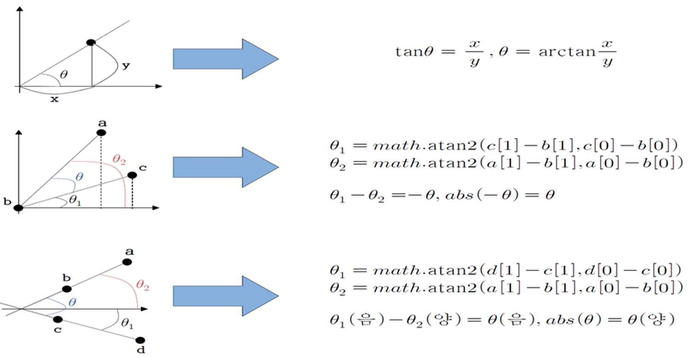

# OpenPose를 이용한 영상처리

-----------------

    
    Authors <a href="https://www.gineshidalgo.com" target="_blank">Gines Hidalgo</a> (left) and <a href="https://jhugestar.github.io" target="_blank">Hanbyul Joo</a> (right) in front of the <a href="http://domedb.perception.cs.cmu.edu" target="_blank">CMU Panoptic Studio</a>, <a href="https://github.com/CMU-Perceptual-Computing-Lab/openpose" target="_blank">CMU-Perceptual-Computing-Lab</a>
    
    

-----------------

## Presentation and Testing Video
- **Youtube**:
    - [**Presentation**](https://youtu.be/ssnje_t5aMg).

-----------------

## Contents
1. [소개](#소개)
2. [Main Function](#main-function)
3. [Using](#using)
4. [Main basic operation and features](#main-basic-operation-and-features)
5. [Main Source Code](#main-source-code)
6. [License](#license)

-----------------

## 소개
- 저희는 4차 산업혁명의 핵심으로 주목받는 지능정보기술을 이용하여 프로젝트를 진행했습니다. 21세기는 기술혁신이 급속도로 세상을 바꾸는 4차 산업혁명 시대입니다. 여러 기술 중에서 특히 지능정보기술은 기계에 인간의 고차원적 정보처리 능력을 부여하는 기술로 4차 산업혁명의 핵심으로 크게 주목받고 있습니다.

- 이 가운데 영상 처리는 인간의 인지 능력 중 하나인 시각을 기계에 부여하기 위해 사용되며, 기계가 센서를 통해 올바른 정보를 취득할 수 있도록 객체 인식, 추출, 잡음/흐림 제거 등 다양한 기법들이 연구되면서 그 중요성 또한 계속해서 증가하고 있습니다.

-----------------

## Main Function
1. **FITNESS CHECKER** : 
    - 팔굽혀 펴기의 개수를 자동으로 Count 해주고 그와 관련된 정보를 알려주는 기능
2. **MOTION TRAINER** : 
    - 어떤 이미지의 동작을 보고 사람이 따라하는 모습을 Cam으로 찍어서, 이미지와 사람의 동작의 오차를 보여주어, 사람이 올바른 동작을 취할 수 있도록 도와주는 기능을 가지고 있습니다.
    - 이미지의 골격 값과 동작 중인 사람의 골격 값을 통해, 현재 사람의 동작이 얼마나 이미지와 차이가 있는지를 눈으로 확인할 수 있어서, 궁극적으로 사람이 아닌 기계를 통해 Fitness Training을 할 수 있게 됩니다.
3. **MIMIC ROBOT** : 
    - Cam에 사람의 유무를 판단하여 팔의 움직임과 머리의 움직임을 체크할 수 있습니다. 그리고 그것의 정보 값을 ESP32에 보내 Robot이 사람의 행동을 따라 할 수 있습니다.

-----------------

## Using
1. **Python** (IDE : Visual Code)
2. [OpenPose Library (OpenCV+Caffe Model)](https://github.com/CMU-Perceptual-Computing-Lab/openpose)
3. **ESP32(WiFi, WEB SOCKET ) + Sub MOTORS + Arduino IDE**
4. **3D Print(for MIMIC ROBOT)**

-----------------

## Main basic operation and features
**1. OpenPose Library**
- OpenPose Library를 이용하였습니다. OpenPose Library는 Caffe와 OpenCV기반으로 구성된 몸의 움직임을 추적해주는 API입니다. 입력으로 이미지나 영상을 웹 캠 또는 IP 카메라와 같은 입력장치로부터 받을 수 있는데 이 프로젝트에서는 이미지와 웹 캠을 이용하였습니다. OpenPose Library를 이용하는 것으로 골격에 대한 정보를 추출할 수 있습니다.

    

- OpenPose Library의 동작원리는 다음과 같습니다. 먼저 이미지를 입력하면 해당 이미지에서의 관절위치와 근육의 운동방향에 대한 정보를 각각 추출한 후에 두 개의 정보를 종합하여 얻은 데이터를 토대로 한 이미지에 다수의 사람이 있더라도 여러 사람들의 관절과 근육을 구분하고 오류를 제거하여 최종 완성된 결과를 내게 됩니다.

    

- 앞서 언급한 관절위치와 근육의 운동방향 추출 방법에 대해 자세히 알아보면 이미지 데이터를 OpenPose Network로 전송하여 10개의 Layer로 이미지 data를 판독하여 Feature가 강조된 형태의 Output으로 출력되게 됩니다. 이제 해당 Output은 1에서 6까지 stage의 입력으로 활용되어 각 stage에서 ground truth라는 정답 Label과의 비교를 통해 loss를 구하고, 이를 Optimize하는 것으로 높은 정확도의 결과값을 얻을 수 있게 됩니다.

**2. Angle Calucator**

    

- 두 번째로 관절을 추출한 이후 동작을 인식하기 위해 각도가 필여하다고 생각했습니다. 그래서 직선 사이의 각도를 구하는 수학적 공식, Arctanget를 이용하여 관절의 각도를 계산했습니다.

**3. Pose Detector**
- 각도 계산이 기본적으로 좌표 값을 이용하여 계산이 되기 떄문에 매 프레임에서 좌표값이 바뀌는 추세를 확인하여 좌표 값의 범위 기준에 따라 다양한 행동을 감지할 수 있습니다.

**4. WebSocket Communication**
- Python OpenCV를 처리된 값들을 단지 화면에 표시하는 방식이 아닌 각 처리된 값을 추출한 뒤 Wi-Fi 모듈을 이용한 웹 소켓 통신 방식으로 데이터를 전송하여 컨트롤하는 시스템을 만들었습니다. 또한 고정 IP를 사용하여 계속해서 바뀌는 IP문제를 해결하기도 하였습니다.

**5. Submotor, Shield**

    

- 로봇 팔을 컨트롤 하기 위해서 다수의 서브모터가 필요했습니다. 서브모터를 좀 더 쉽게 제어를 하기 위하여 ESP32전용 서브모터 쉴드를 자체 제작하였습니다. 쉴드의 특징은 470uF 캐패시터를 이용하여 전류 부족 문제를 해결할 수 있었꼬, 그라운드, 전원 핀을 시그널 핀의 옆에 같이 만듦으로써 불필요한 선 연결을 없앴습니다.

**6. Robot by 3D Printer**

    

- 카메라에서 추출된 데이터 값을 이용하기 위한 로봇을 3D 프린터와 서브모터를 활용하여 제작을 하였습니다.

-----------------

## Main Source Code
- **Detailed Code** : can be found in each directory.

**1. FITNESS CHECKER**

    

**2. MOTION TRAINER**

    

**3. MIMIC ROBOT**

    
    

-----------------

## License
OpenPose is freely available for free non-commercial use, and may be redistributed under these conditions. Please, see the [license](LICENSE) for further details. Interested in a commercial license? Check this [FlintBox link](https://cmu.flintbox.com/#technologies/b820c21d-8443-4aa2-a49f-8919d93a8740). For commercial queries, use the `Contact` section from the [FlintBox link](https://cmu.flintbox.com/#technologies/b820c21d-8443-4aa2-a49f-8919d93a8740) and also send a copy of that message to [Yaser Sheikh](mailto:yaser@cs.cmu.edu).